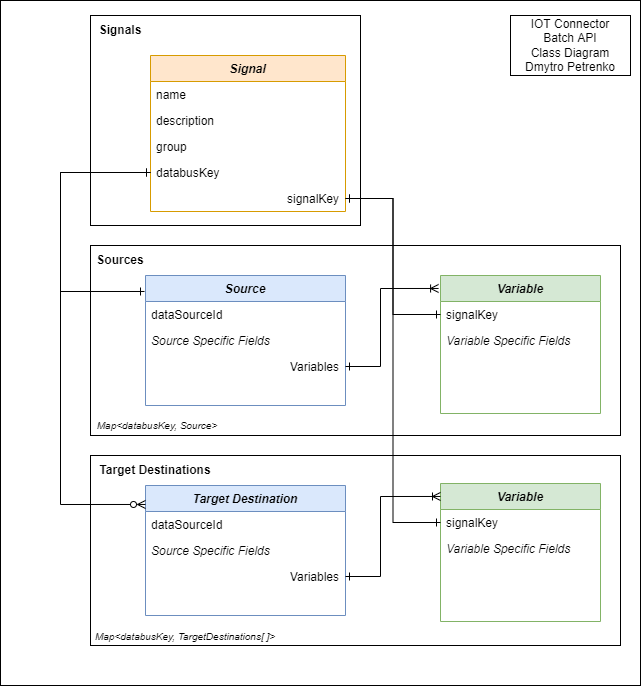

# iot-connector

`please note, this project is provided as example for base IoT implementation. SDK, DataSource service and Orchestrator are not available in public access`

`IoT Connector` is a part of `IoT` data flow to stream data to and from System through Orchestrator with help of connectors, consisting of sensors, which stream data into platform, and publishers, which stream data out of platform. Also as a part of `Edge Computing` Paradigm `IoT Connector` optimizes devices and connected applications by bringing them closer to the source of the data (DataSource concept) 

`IoT Connector` receives signal data from IoT Middleware via REST API calls, processes data, manipulates IOT sensors/publishers (sensor/publisher configuration modules) from received data via transaction requests to IoT Orchestrator with help of SDK. Data Source configurations are recieved via REST API requests to IoT DataSource Service. Processed data of sensors/publishers modules, variables, settings is stored in cache (node-cache) and Mongo DB. 

A possibility to retrieve info about sensors, publishers, variables grouped in signal abstraction is implemented with use of REST API calls to IoT Connector. 

# Design

IoT subsytem boundaries are shown on below diagram, subsystem represents a part of Overall System Architecture

IoT Connector layered architecture is shown on below diagram

# DataSource Concept

`DataSource concept` serves for registration of protocol, architecture or platform-based tools, which allow connector management, based on the predefined type. DataSource approach is planned to simplify the understanding of structure to IoT devices, thus allowing user to focus more on signal abstraction usage.

The following DataSources are available (in parentheses there is a link to IoT provider/protocol/tool used):

- AWS IoT ([AWS IoT](https://docs.aws.amazon.com/iot/latest/developerguide/what-is-aws-iot.html))
- MQTT ([MQTT: The Standard for IoT Messaging](https://mqtt.org/)
- RabbitMQ ([RMQ for IoT](https://funprojects.blog/2018/12/07/rabbitmq-for-iot/))
- OPC Unified Architecture ([Unified architecture](https://opcfoundation.org/about/opc-technologies/opc-ua/))

# Batch API

IoT Connector Batch API Class Diagram with dependencies

Batch API of IoT Connector allows to perform batch/bulk operations over multiple signals data, which includes signals, sources, targetDestinations. The request object is expected to cover the mentioned above dependencies, which are being validated (check diagram also):

- signals must contain `signalKey` and `databusKey`.
- databusKey relates as 1:1 to sources, and 1:M(0) to targetDestinations(can be empty)
- signalKey relates as 1:1 to variable in `source.variables`, so each signal must have precisely 1 variable by `signalKey`
- sources and targetDestinations Maps can't be empty(shoud have the same number of keys as summary of `databusKeys` from signals), but targetDestinations can have empty keys (key: [])
- sources `Map<string, Source>` has string keys, which are databusKeys
- target destinations `Map<string, TargetDestination[]>` has string keys, which are also databusKeys

Batch API also performs operations with outgoing signals (which use default MQTT or RMQ datasourceId in their source). The response models have following logic:

- In unpublished state each outgoing signal has boolean flag `isOutgoing === true` and is connected to source via databusKey, but there is no targetDestinations (`Map<string, TargetDestination[]>.get(databusKey)` will return empty array [])
- In published state outgoing signal's standard connection via databusKeys persists.

# Primary Modules

IoT Connector Primary Modules Class Diagram with dependencies

Primary modules allow the functionality, which means the use case, when IoT side automatically uses primary module available at DataSource Manager, which is dynamic and can be changed by the user. On some future datasets/datasource types it is also possible to even have modules (sensors/publishers) without explicit dataSource. Anyways on IoT Connector side dataflow is highly dependent on dataSource type and databusKey connection, even if in primary module case data is dynamic or absent. 

That's why the datasource data is persisted (in other words emulated) with `virtual dataSource entity` (dotted line on diagram). It means the data, which belongs to dataSource is still created and stored by IoT Connector, but for the primary module there can be no real dataSource data put into existence or the dataSource can be changed by user without data consistency alteration.

- `databusKey` is stored in virtual datasource and used in 1:1 relationship on source/sensor level
- `type` must be acquired from incoming data, so when configuring source/targetDestination for primary level fields `isPrimary` and `dataSourceType` must be provided.
- if sensor/publisher has `isPrimary: true` then dataSource by id is `virtual` and can't be found in corresponding dataSource collection
- `virtual` dataSource is marked with `isVirtual: true` field and is used only for databusKey processing for primary modules
- `virtual` dataSource is cached also
- Exception: in unpublished state outgoing signal doesn't have any `real` or `virtual` dataSource, so it's source module doesn't have `isPrimary` flag at all

# Direct External Dependencies

- IoT Orchestrator
- IoT DataSource Service
- IoT Middleware

# Protocols

- http
- amqp/mqtt

# Dependencies substitution

- "@iot-configurator/sdk": "2.5.5",
